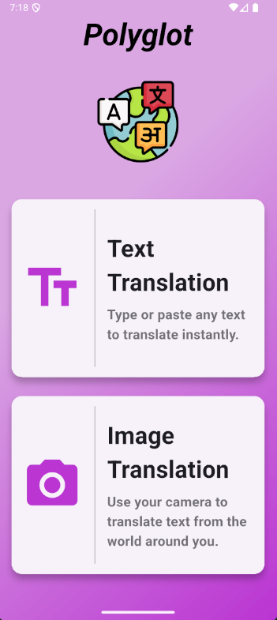
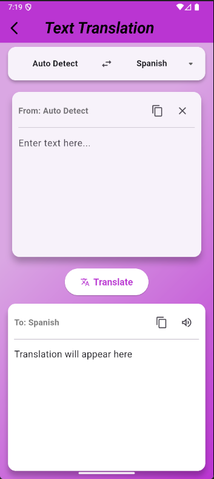
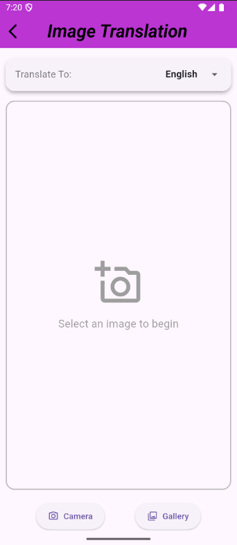

# 🌍 Polyglot - A Smart Translator App

**Tagline:** *Your world, translated.*

Polyglot is a feature-rich, cross-platform language translator app built entirely with Flutter. It's designed to be a clean, intuitive, and powerful tool to help users break down language barriers—whether translating simple text or text from an image.

---

## ✨ Features

### 🔤 Text Translation
A complete, end-to-end text translation experience with a responsive, split-screen UI.

- **Dynamic Language Detection**: Automatically identifies the source language as you type.
- **Language Selector**: User-friendly dropdown to choose the target language.
- **Swap Languages**: Instantly switch source and target languages.
- **Clipboard Functionality**: Easily copy or clear text with a single tap.

### 🖼️ Image Translation
Translate text from the world around you using your phone's **camera or gallery**.

- **Camera & Gallery Support**: Choose an image or capture a new one.
- **On-Device OCR**: Fast, private Optical Character Recognition using Google ML Kit.
- **Clean Result Display**: Dedicated results screen for recognized and translated text.
- **Dynamic Language Selection**: Choose target language before translating image text.

---

## 🛠️ Tech Stack & Architecture

### 📦 Framework & Language
- **Framework**: Flutter
- **Language**: Dart

### 🧱 Architecture
- **Pattern**: Feature-First Architecture — code is organized by features (`text_translation`, `image_translation`, etc.)
- **State Management**: Local state via `StatefulWidget` and `setState`

### 🔌 API & Packages
- **Translation**: [`translator`](https://pub.dev/packages/translator) (Google Translate API client)
- **OCR**: [`google_mlkit_text_recognition`](https://pub.dev/packages/google_mlkit_text_recognition)
- **Image Handling**: [`image_picker`](https://pub.dev/packages/image_picker)
- **Text-to-Speech**: [`flutter_tts`](https://pub.dev/packages/flutter_tts)

### 🎨 UI/UX
- **Responsive Design**: Layout widgets like `Expanded`, `MediaQuery`, and `SingleChildScrollView` used to adapt to screen sizes and avoid overflows.
- **Reusable Components**: Custom widgets like `FeatureCard` and `LanguageSelector` used to ensure modularity and clean UI.

---

## 🚀 Getting Started

### 📋 Prerequisites
Make sure you have Flutter installed. Follow the [Flutter Installation Guide](https://docs.flutter.dev/get-started/install).

### ⚙️ Installation

1. **Clone the repo**
   ```bash
   git clone https://github.com/Angadthakur/Polyglot
   ```

2. **Navigate to the project directory**
   ```bash
   cd polyglot-translator-app
   ```

3. **Install dependencies**
   ```bash
   flutter pub get
   ```

4. **Run the app**
   ```bash
   flutter run
   ```

---

## 📸 Demo

### 🧭 Home Screen  


### ✍️ Text Translation  


### 📷 Image Translation  


### 🎥 Full Walkthrough  
[](https://youtube.com/shorts/8-Klszd20p0)

*Click the image above to watch the complete app demonstration*

---

## 🔄 Future Enhancements

- **Voice Translation**: Speech-to-text and text-to-speech functionality
- **Offline Mode**: Download language packs for offline translation
- **Conversation Mode**: Real-time two-way translation
- **History & Favorites**: Save and organize translation history
- **Cloud Sync**: Sync translations across devices

---

## 🤝 Contributing

Contributions, issues, and feature requests are welcome! Feel free to check the [issues page](https://github.com/Angadthakur/Polyglot/issues).

1. Fork the Project
2. Create your Feature Branch (`git checkout -b feature/AmazingFeature`)
3. Commit your Changes (`git commit -m 'Add some AmazingFeature'`)
4. Push to the Branch (`git push origin feature/AmazingFeature`)
5. Open a Pull Request

---

## 📄 License

This project is licensed under the MIT License - see the [LICENSE](LICENSE) file for details.

---

## 👤 Contact

**Angad Thakur**  
LinkedIn: [www.linkedin.com/in/angad-thakur-51817b280](https://www.linkedin.com/in/angad-thakur-51817b280)

## 🔗 Project Link
[https://github.com/Angadthakur/Polyglot](https://github.com/Angadthakur/Polyglot)